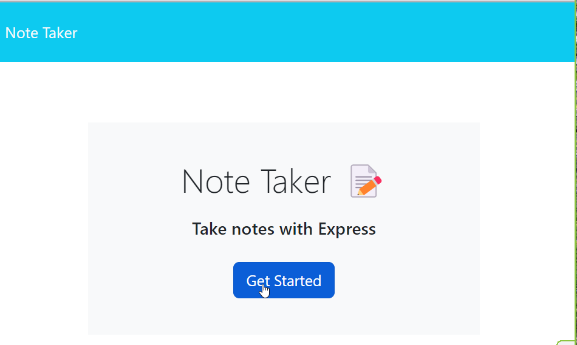
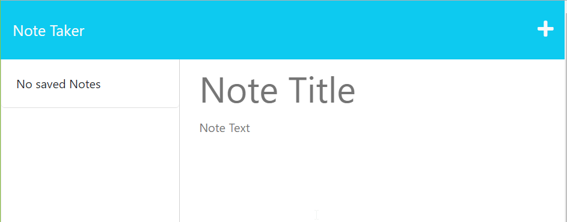
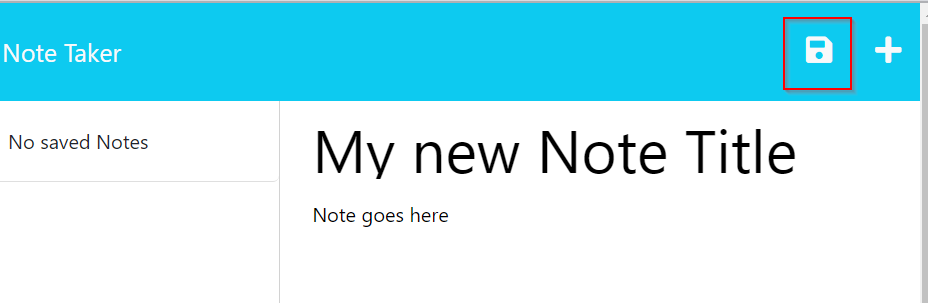
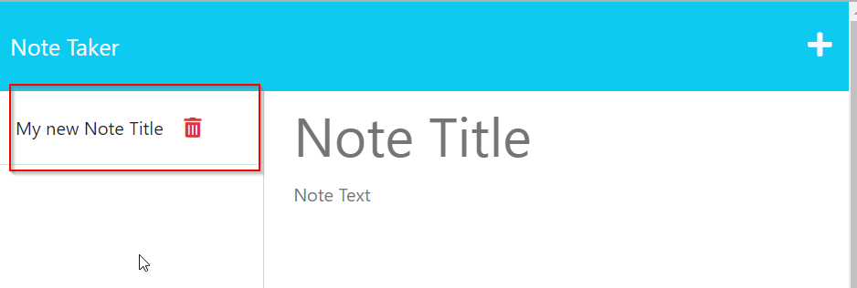
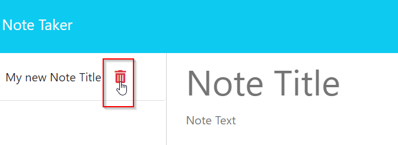

# Note Taker| 11 Weekly Challenge 

## Description

This application takes a user's input to create a note and saves it to a local database.

The code for this application is available at: https://github.com/shockeyj9/Note-Taker

The Heroku deployment for this application is available at: https://afternoon-shelf-09428-f47ee20e09cf.herokuapp.com/

## Table of Contents

  1. [ Description ](#description)
  2. [ Installation ](#installation)
  3. [ Usage ](#usage)
  3. [ License ](#license)
  3. [ How to Contribute ](#how-to-contribute)
  3. [ Questions ](#questions)
## Installation

Inquirer version 8.2.4 and uniqid

## Usage

This application should be used to create simple notes. To start the application the user must select the "Get Started" button:

The user is then directed to a new html page where they can enter the notes title and the note itself. After entering the information the user can then select the save button:

Once saved, the page can be refreshed and the new note reflects on the left hand side:

The user can then delete a note by selecting the red trash can to the right of the note:

Once done, the application can be refreshed and the note will no longer appear:

## License

http://choosealicense.com/licenses/mit/ 

A short and simple permissive license with conditions only requiring preservation of copyright and license notices. Licensed works, modifications, and larger works may be distributed under different terms and without source code. 

## How to Contribute

Please do not contribute, this project is not maintained.

## Questions

Please visit my GitHub profile [shockeyj9](https://github.com/shockeyj9)

Feel free to reach out with any questions: shockeyjessie92@gmail.com

